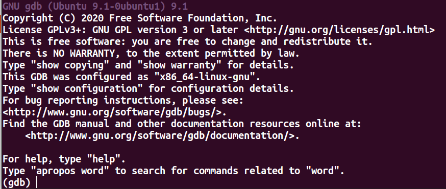
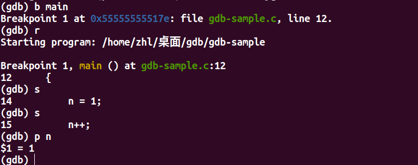

# 1 快速使用

（1）编译文件

```shell
gcc gdb-sample.c -o gdb-sample -g
```

-g：表示将源代码信息编译到可执行文件中，如果不加，GDB调试会不方便

（2）运行gdb：在shell中输入`gdb`即可



（3）进入gdb后，使用`file`命令打开调试文件

```
file gdb-sample
```

（4）直接运行：r

（5）在指定函数名或行号处打断点（breakpoint）：b 函数名\行号

（6）打完断点后，**重新运行代码**

（7）单步跟踪step in，进入函数：s

（8）打印变量：p 变量名

​		  $1 表示 p 使用的次数



（8）q：退出gdb


# 2 详细操作

几种进入gdb调试的方式：

（1）生成`.out`文件调试

```shell
gcc gdb-sample.c -g #生成a.out*文件
gdb a.out #进入gdb
```

（2）一步到位生成可执行文件

```shell
gcc gdb-sample.c -o gdb-sample -g #生成gdb-sample*文件
gdb gdb-sample #进入gdb
```

（3）进入gdb后使用`file`打开一个文件进行调试

```shell
#前提：已存在一个可调试的文件
(gdb)file gdb-sample
```


## 2.1 设置断点 breakpoint

b，全称break

- `b 行号\函数名`
- `b 源代码:行号\函数名`
- `info b`：查看所有断点
- `delete [n1 n2]`：删除断点，n1，n2为断点编号，不给编号表示删除所有断点


**循环条件断点**：

条件断点要打在循环体里面，不能打在for、while所在行

- `b 行号 if condition`：当满足条件时暂停
- `u`：全称until，跳出循环


## 2.2 调试

- `list`：显示一段代码（`l`继续显示代码）

- `r`：若无断点，正常运行程序；否则进入DEBUG模式

- `s`：全称step\start，单步跟踪，进入函数，类似 step in

- `n`：全称next，单步跟踪，不进入函数，类似 step out

- `c`：全称continue，跳到下一个断点
- `return`：跳出当前函数
- `finish`：运行当前函数，直到函数返回


**反向调试**

（1）打断点

（2）可以设置watch变量

（3）`record`：记录变量，方便回溯，仅在当前作用域有效（当遇到一些IO语句时可能会报错，无法记录，使用return跳出函数即可）

（4）反向调试：`reverse`

- `reverse-continue`：返回到上一个断点
- `reverse-step`：返回上一个s执行的语句
- `reverse-next`：返回上一个n执行的语句
- `reverse-finish`：返回到当前函数起始行

（5）`record stop`：停止记录


## 2.2 查看、监视变量

p，全称print

- `p 变量名`：打印变量值
- `watch 变量名`：监视变量
- `ptype 变量名`：查看变量类型


- `display 变量名`：追踪查看具体变量值
- `undisplay 变量名`：取消追踪


# 3 多进程调试

使用gdb调试的时候，默认只能跟踪父进程，可以在**fork()函数调用前**，通过指令来改变跟踪的进程：

- `set follow-fork-mode child`：跟踪子进程
- `set follow-fork-mode parent`：跟踪父进程