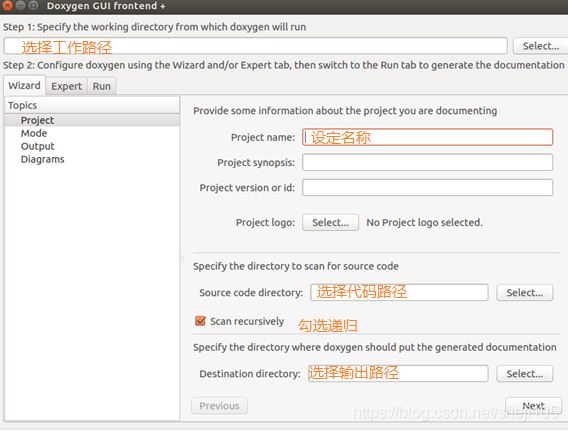
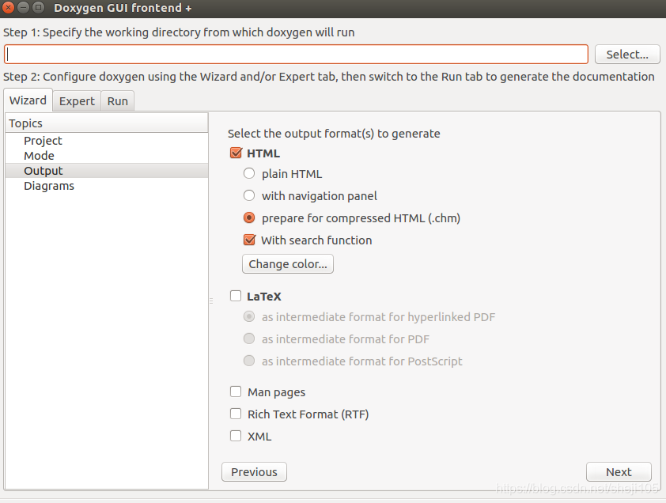
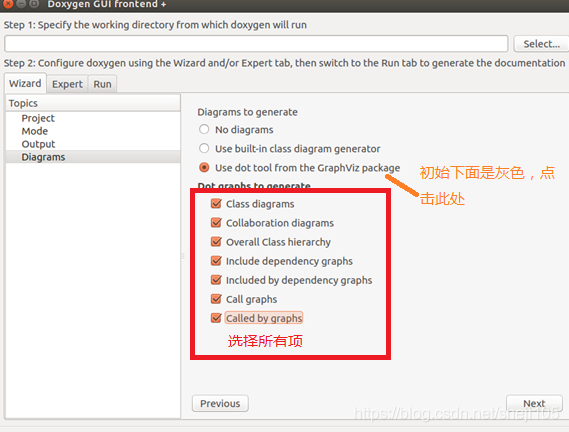
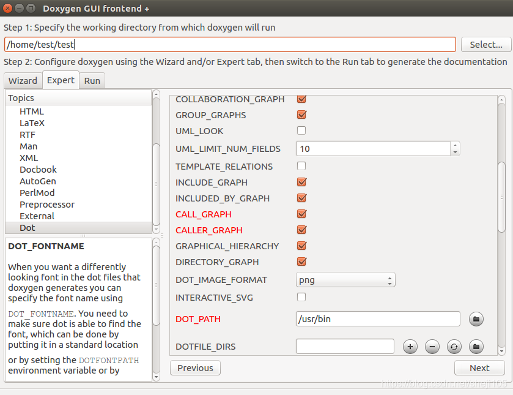
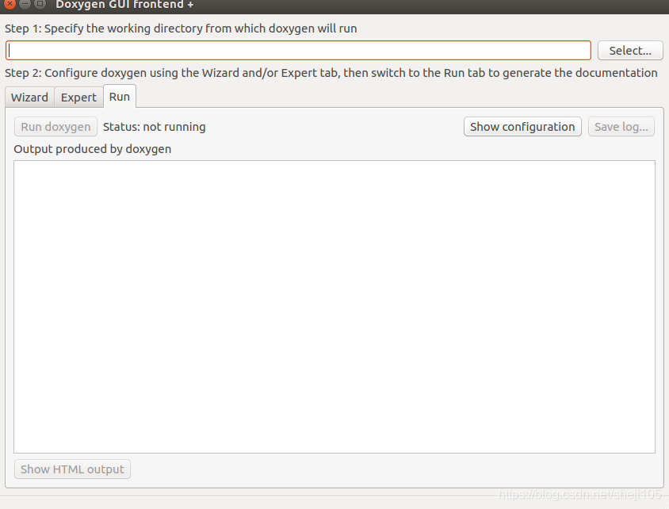

# 1 egypt+graphviz

本文主要通过`gcc`+`egypt`+`graphviz(dot)`三个工具轻松生成源码的函数调用关系图

## graphviz 安装

Graphviz （Graph Visualization Software的缩写）是一个由AT&T实验室启动的开源工具包，用于绘制DOT语言脚本描述的图形。
ubuntu下可以直接安装；

```shell
sudo apt-get install graphviz
```

成功安装`graphviz`,这里我们就可以使用`dot`工具了,具体方法可用`dot -?`命令查看

## egypt 安装

egypt官网: `http://www.gson.org/egypt/`

下载后的文件为egypt-1.10.tar.gz;找到文件所在路径；

```shell
sudo find \ -name egypt-1.10.tar.gz
```

然后解压:

```shell
sudo tar -xvf egypt-1.10.tar.gz
```

解压得到egypt-1.10;

```shell
cd egypt-1.10 && sduo chmod +x egypt
```

将egypt移动到/usr/bin,方便后面直接调用,或者将当前egypt所在路径添加到环境变量中；

```shell
sudo cp egypt /usr/bin
```

以上,已经完成了egypt的安装；


使用方法如下;

```shell
egypt [--omit function,function,...] [--include-external] <rtl-file>... | dotty -
egypt [--omit function,function,...] [--include-external] <rtl-file>... | dot <dot-options>
```

## 编译

假设一个有一个源文件`test.c`

编译需要加上参数`-fdump-rtl-expand`生成相应的dump文件；

```shell
gcc -fdump-rtl-expand -c test.c
```

使用`.expand`文件生成调用关系图的代码

```shell
egypt test.c.223r.expand | dot -T png -o test.png
```

## 快速生成脚本

使用命令

```shell
python3 script.py -f 15-2CGIServer.cc
```

> 生成15-2CGIServer.cc的代码解析图code_parse.png，该图片存放在与script.py同目录下

```python
import os
import argparse

print("generating code picture...")
# 输入源文件名参数
parser = argparse.ArgumentParser()
parser.add_argument("-f", "--source_file.c", help="generate a code_picture for a .c/.cc file", type=str, dest="source_file")
args = parser.parse_args()

# 获得源文件名
source_file = args.source_file

# 获得源文件所在路径
find_str = "sudo find / -name " + source_file
process = os.popen(find_str)        #shell输出保存在process中
source_file_path = process.read()   #读取输出内容
process.close()

# 编译源文件
make_str = "g++ -fdump-rtl-expand -c " + source_file_path
os.system(make_str)

# 生成代码调用图
files = os.listdir('./')
for f in files:
    if "expand" in f:
        expand_file = f
shell_str = "egypt " + expand_file + " | dot -T png -o code_parse.png"
os.system(shell_str)

# 查看图片
os.system("rm *.expand *.o")
os.system("xdg-open code_parse.png")
print("success!")
```


# 2 doxygen+graphviz

## doxygen安装

Doxygen是一种开源跨平台的，以类似JavaDoc风格描述的文档系统，完全支持C、C++、Java、Objective-C和IDL语言，部分支持PHP、C#。注释的语法与Qt-Doc、KDoc和JavaDoc兼容。Doxygen可以从一套归档源文件开始，生成HTML格式的在线类浏览器，或离线的LATEX、RTF参考手册。

```shell
 sudo apt-get install doxygen doxygen-gui
 
 #查看版本
 doxygen -v
```


## doxygen配置

```shell
#打开配置UI
doxywizard
```

- 配置工程信息



- 配置模式：根据代码语言选择对应选项


- 配置输出项



- 配置图表（关键）



- 配置Expert：语言选择中文


- [Expert]往下拉到[dot], DOT_PATH选择为/usr/bin。点击【Next】



> 其他dot选项

```
#---------------------------------------------------------------------------
# Configuration options related to the dot tool
#---------------------------------------------------------------------------
CLASS_DIAGRAMS         = YES
MSCGEN_PATH            = 
DIA_PATH               = 
HIDE_UNDOC_RELATIONS   = YES
HAVE_DOT               = YES----------------------------打开dot功能。
DOT_NUM_THREADS        = 0
DOT_FONTNAME           = Helvetica----------------------设置dot功能的字体和大小。
DOT_FONTSIZE           = 10
DOT_FONTPATH           = 
CLASS_GRAPH            = YES----------------------------类等关系图。
COLLABORATION_GRAPH    = YES
GROUP_GRAPHS           = YES
UML_LOOK               = NO
UML_LIMIT_NUM_FIELDS   = 10
TEMPLATE_RELATIONS     = NO
INCLUDE_GRAPH          = YES----------------------------include关系图。
INCLUDED_BY_GRAPH      = YES
CALL_GRAPH             = YES----------------------------调用和被调用关系图。
CALLER_GRAPH           = YES
GRAPHICAL_HIERARCHY    = YES
DIRECTORY_GRAPH        = YES
DOT_IMAGE_FORMAT       = png----------------------------dot输出的图像格式。
INTERACTIVE_SVG        = NO
DOT_PATH               = /usr/bin/dot-------------------一定要指定的系统中dot路径。
DOTFILE_DIRS           = 
MSCFILE_DIRS           = 
DIAFILE_DIRS           = 
PLANTUML_JAR_PATH      = 
PLANTUML_INCLUDE_PATH  = 
DOT_GRAPH_MAX_NODES    = 50
MAX_DOT_GRAPH_DEPTH    = 0
DOT_TRANSPARENT        = NO
DOT_MULTI_TARGETS      = NO
GENERATE_LEGEND        = YES
DOT_CLEANUP            = YES
```


## doxygen运行

- 选择项目目录后，点击[Run doxygen]生成相关文件



- 点击[Show HTML output]查看生成的调用关系网页


- 关闭GUI，弹出如下对话框，点击[Save]生成配置文件`Doxyfile`


- 在shell下运行如下命令，重新生成调用关系

```shell
doxygen Doxyfile
```

