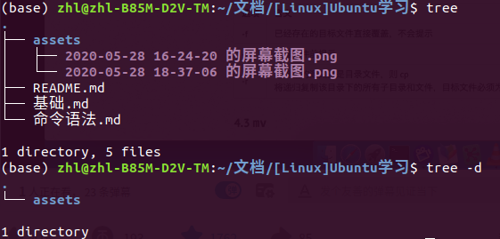

# 1 命令语法

命令 [-选项] [参数]，命令后面跟上`--help`，可以查看可选项

可以将多个选项==写在一起==

如：`ls -la /etc`，相当于：`ls -l /etc` 和 `ls -a /etc` 

# 2 常用文件目录命令

## pwd：查看当前目录路径

## cd：切换目录

`cd [文件目录]`：切换到指定的文件目录

`cd ..`：回到上级目录

`cd ~`：切换到当前用户的主目录(/home/用户名)

`cd .`：保持在当前目录不变

`cd -`：在最近两次工作目录之间来回切换

## ==ls：显示文件目录==

`ls [-a, -l, -d, -i] [文件目录]`：

- -a：显示所有文件，包含隐藏文件
- -l：显示所有文件详细信息
- -d：查看目录属性
- -i：查看文件id号
- -h：人性化显示文件大小

### 参数分析

- 第一个`zhl`代表所有者（只能有一个）

- 第二个`zhl`代表所属组（只能有一个）

- 4096代表文件的大小（默认单位为kb）

`d rwx r-x r-x`：

- `d`：表示这个文件是一个文件目录（蓝色字体显示）
- `-`：表示这个文件是一个文档（白色字体显示）
- `rwx r-x r-x`：划分为三部分（u所有者，g所属组，o其他人），r读，w写，x执行（最高权限)
  
    - `rwx`：表示当前用户拥有所有权限
    - `r-x`：表示所属组有读和执行的权限
    - `r-x`：表示其他用户有读和执行的权限
    

### 联合正则表达式一起使用

`ls [正则表达式]`：显示与正则表达式向匹配的文件目录

常用正则表达式：

- `*`：表示任意**一个**或**多个**字符
- `?`：表示任意**一个**字符
- `[abc]`：表示匹配a、b、c中的任意一个字符
- `[a-f]`：表示匹配a-f范围内的任意一个字符

## tree：显示文件目录的树状图

`tree [-d] [文件目录]`：

- -d：只显示文件目录中的所有文件夹，不显示文档

## mkdir：创建目录

`mkdir -p [文件目录]`：创建多级目录，如`mkdir -p /usr/local/python`

## rmdir：只能删除空目录

 `rmdir [文件目录]`：只能删除空的文件夹

## cp：复制文件目录

`cp [-r, -rp] [文件目录]`：

- -i：覆盖文件前进行提示

- -r：复制目录
- -rp：复制目录，并保留文件属性（创建时间、修改时间等）

## mv：剪切文件目录

`mv [原文件目录1 原文件目录2...] [目标文件目录]`：剪切一个或多个文件至目标文件目录，可以进行更名操作

- -i：覆盖文件前进行提示

如：`mv /tmp/usr/hello.txt /root`，将`hello.txt`剪切到`/root`下

 `mv /tmp/usr/hello.txt /root/hi.txt`，将`hello.txt`剪切到`/root`下，并改名为`hi.txt`

## rm：删除文件目录

`rm [-r, -f, -rf] [文件目录]`：将文件从磁盘删除，删除后**==无法恢复==**

- -r：删除目录
- -f：强制执行
- -rf：删除整个目录

# 3 常用文档使用命令

## ==touch：创建文档==

`touch [文档名]`：创建一个空白文档，如`touch test.txt`

如果test.txt已经存在，就会修改该文档的最近修改时间

## gedit：打开文档

`gedit [文档名]`：打开文档

## cat：显示文档

`cat [-n] [文档名]`：

- -n：显示所有的行号
- -b：如果是空行，不显示它的行号

### head/tail：显示文档前/后几行

`head [-n num] [文档名]`：

- -n num：显示num行

## tac：反向显示文档

`tac [文档名]`：反向显示时，无法使用可选项 -n

## less/more：分页显示文档

`less [文档名]`：但文档内容过多时可以使用此命令

- 向上翻页：PageUp

- 向下翻页：空格或 F 
- 换行：Enter
- 退出：Q

- 搜索关键词：`/关键词`，N表示next，往下搜索

## grep：查找文档中的字符串

`grep [-iv] [查找的字符串] [文件目录]`：在指定文件中查找字符串

- -n：显示匹配的行及行号

- -i：查找的字符串不区分大小写
- -v：排除指定字符串所在行

如：`grep -iv hello /home/zhl/test.txt`：查找test.txt中hello字符串

### 联合正则表达式查找（模式查找）

常用正则表达式：

- `^a`：匹配首字符，搜索以a开头的行
- `ke$`：匹配尾字符，搜索以ke结尾的行

如：`grep ^h -n test.txt`：查找test.txt中以h开头的行，并显示行号

# 4 常用文件搜索命令

## find：文件搜索 

`find [搜索目录] [搜索条件] [具体条件]`：

- 搜索条件：
  - -name：文件名，具体条件为文件名
  - -size：文件大小，具体条件为文件大小（单位为kb）
  - -user：文件所有者，具体条件为用户名
  - -group：文件所属组

如：`find / -size +204800`：在根目录下搜索大于100MB的文件（+大于，-小于）

# 5 其他常用命令

## echo：打印

`echo ...`：在终端打印后面跟着的字符串

如，`echo hello world`：终端会打印`hello world`

这个命令通常与重定向一起使用

## >：重定向、>>：追加

`echo hello world > a.txt`：重定向有点类似保存操作，就是将 `hello world`保存到 a.txt 中

`echo hi >> a.txt`：将`hi`追加到 a.txt 的末尾 

## |：管道

`命令行1 | 命令行2`：对命令行1的输出结果执行命令行2
