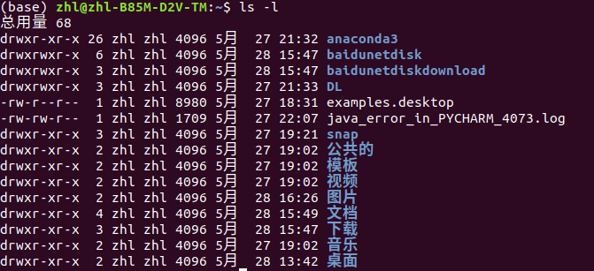

# 1 命令语法

命令 [-选项] [参数]，命令后面跟上`--help`，可以查看可选项

可以将多个选项==写在一起==

如：`ls -la /etc`，相当于：`ls -l /etc` 和 `ls -a /etc` 

# 2 常用文件目录命令

## pwd：查看当前目录路径

## cd：切换目录

`cd [文件目录]`：切换到指定的文件目录

`cd ..`：回到上级目录

## ls：显示文件目录

`ls [-a, -l, -d, -i] [文件目录]`：

- -a：显示所有文件，包含隐藏文件
- -l：显示所有文件详细信息
- -d：查看目录属性
- -i：查看文件id号

### 参数分析

- 第一个`zhl`代表所有者（只能有一个）

- 第二个`zhl`代表所属组（只能有一个）

- 4096代表文件的大小（默认单位为kb）

`d rwx r-x r-x`：

- `d`：二进制文件 

    - l： 软链接文件

- `rwx r-x r-x`：划分为三部分（u所有者，g所属组，o其他人），r读，w写，x执行（最高权限)
  
    - `rwx`：表示所有者拥有所有权限
    - `r-x`：表示所属组有读和执行的权限
    
    

## mkdir：创建目录

`mkdir -p [文件目录]`：创建多级目录，如`mkdir -p /usr/local/python`

## rmdir：只能删除空目录

 `rmdir [文件目录]`：只能删除空的文件夹

## cp：复制文件目录

`cp [-r, -rp] [文件目录]`：

- -r：复制目录
- -rp：复制目录，并保留文件属性（创建时间、修改时间等）

## mv：剪切文件目录

`mv [原文件目录1 原文件目录2...] [目标文件目录]`：剪切一个或多个文件至目标文件目录，可以进行更名操作

如：`cp /tmp/usr/hello.txt /root`，将`hello.txt`剪切到`/root`下

 `cp /tmp/usr/hello.txt /root/hi.txt`，将`hello.txt`剪切到`/root`下，并改名为`hi.txt`

## rm：删除文件目录

`rm [-r, -f, -rf] [文件目录]`：

- -r：删除目录
- -f：强制执行
- -rf：删除整个目录

# 3 常用文档使用命令

## touch：创建文档

`touch [文档名]`：创建一个空白文档，如`touch test.txt`

## cat：显示文档

`cat [-n] [文档名]`：

- -n：显示行号

### head/tail：显示文档前/后几行

`head [-n num] [文档名]`：

- -n num：显示num行

## tac：反向显示文档

`tac [文档名]`：反向显示时，无法使用可选项 -n

## less：分页显示文档

`less [文档名]`：但文档内容过多时可以使用此命令

- 向上翻页：PageUp

- 向下翻页：空格或 F 
- 换行：Enter
- 退出：Q

- 搜索关键词：`/关键词`，N表示next，往下搜索