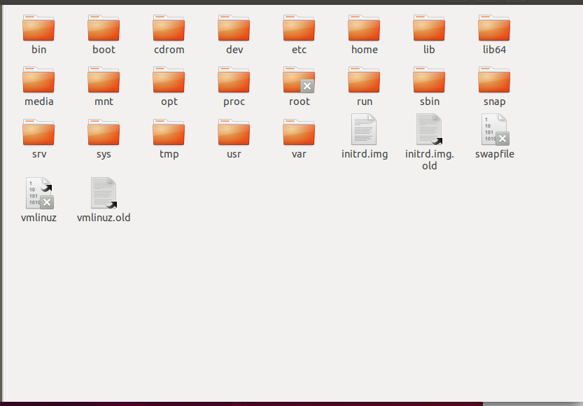

# Linux 基础知识

Linux 是==多用户操作系统==，即，多个用户可以同时访问 Linux 系统。

Linux 没有盘符的概念，只有一个根目录：`/`

在这个根目录下，划分了以下几个重要的子目录，这些子目录存储了相应的文件：

- `/bin`：存放系统命令
- `/boot`：系统启动目录，保存系统启动相关的文件，如内核文件和启动引导程序(grub)文件等
- `/dev`：保存设备（硬盘，U盘，光盘等）文件
- `/etc`：保存配置文件，如用户名和密码，服务的启动脚本，常用服务的配置文件等
- `/home`：普通用户的==家==目录，如用户`user1`的家目录就是`/home/user1`
- `/usr`：系统自带的软件，大多数保存在此目录中
  - `/usr/local`：保存第三方软件（也可以存放到 `/opt` 中）
- `/mnt`：挂载目录，当U盘、移动硬盘或其他操作系统的分区接入Linux时，需要进行挂载才能读取

# 其他注意事项

- Linux 严格区分大小写

- Linux ==所有内容==都是以==文件形式==保存的，包括**硬件**：
  - 硬盘文件是：`/dev/sd[a-p]`（或`/dev/sd[1-5]`）
- Linux 的文件实际上没有扩展名，但是默认会以扩展名的形式加以区分：
  - 压缩包：`*.gz`、`*.bz2`、`*.tar.bz2`、`*.tgz`
  - 二进制软件包：`*.rpm`
  - 脚本文件：`*.sh`
  - 配置文件：`*.conf`

