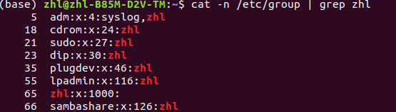
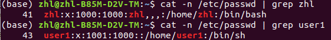
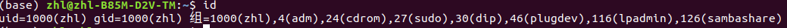

# 1 用户权限

Linux是多用户系统，每个用户可以指定不同的权限和文件目录。

用户对文件的权限包括：

- r：只读
- w：只写
- x：可执行权限，能够使用终端命令

## 1. 1 chmod：修改文件权限

`chmod [-, +] [rwx] 文件目录`：`-`减少权限，`+`增加权限

## 1.2 chown：修改文件的拥有者

`chown 拥有者用户名 文件目录`

# 2 root 超级用户

`root` 超级用户用于系统的维护和管理，对Linux系统具有所有权限。

Linux安装的过程中，系统会自动创建一个用户账户，这个默认账户就是**标准用户**

当标准用户想要对系统进行维护和管理时，需要在命令前加上`sudo`

## 2.1 sudo

sudo 命令表示用其他身份来执行命令，预设的身份为`root`

# 3 组

在实际应用中，先对组设置权限，再将多个用户添加到组，在组中，每个用户的权限一样，这样就不用为每个用户设置权限。

一个用户可以添加到多个组，拥有多个组的权限。

## 3.1 添加组、删除组、确认组信息

只有超级管理员才能对组进行操作，因此要使用`sudo`命令。

- `sudo groupadd 组名`：添加组
- `sudo groupdel 组名`：删除组
- `cat /etc/group`：确认组信息，组信息保存在`/etc/group`
- `sudo chgrp 组名 文件目录`：修改文件目录的所属组

## group 文件介绍

查看组名为zhl的组信息，各项信息用冒号隔开：

第一个表示组名，第二个表示密码，第三个表示UID，最后一个表示用户名

如图，组名zhl，用户名zhl

`zhl:x:1000`：表示zhl组的GID

其他行表示：zhl用户可以访问其他组

# 4 用户管理

## 4.1 添加用户、设置用户密码、删除用户、确认用户信息

只有超级管理员才能对用户进行操作，因此要使用`sudo`命令。

- `sudo useradd -m -g 组名 新用户名`：添加用户
  - -m：自动建立用户家目录
  - -g：为新用户指定组名，否则会建立一个和用户同名的组
- `sudo passwd 用户名`：为新用户设置密码
- `sudo userdel -r 用户名`：删除用户
  - -r：会自动删除用户家目录
- `cat /etc/passwd | grep 用户名`：确认用户信息，用户信息保存在 `/etc/passwd`

## passwd 文件介绍

分别查看zhl用户和user1用户的信息，文件使用冒号`:`分隔开

第一个表示用户名

第二个表示密码（x表示密码进行了加密）；

第三个数字串表示UID

第四个数字串表示GID；

第五个表示用户的全名，如果没有设置，则用第一个的用户名作为全名；

第六个表示用户的家目录`/home/zhl`；

第七个表示登录时使用的shell，就是登录之后，使用的终端命令所在目录

## 4.2 查看用户信息

- `id 用户名`：查看用户UID（用户代号）、GID（组代号）

- `who`：查看当前所有登录的用户列表
- `whoami`：查看当前登录用户的账户名

## 4.3 修改用户的主组和附加组

使用`id`查看当前用户的信息，gid的是主组的id，后面则是附加组的id和组名

`sudo usermod [-g, -G, -s] 组名 用户名`：设置用户的主组和附加组，修改用户登录shell

- -g：修改用户的主组
- -G：修改用户的附加组，增加权限
- -s ：修改用户登录shell

## 4.4 切换用户

`su - 用户名`：切换用户，`-`表示定位到用户的家目录

`exit`：退出当前登录账户