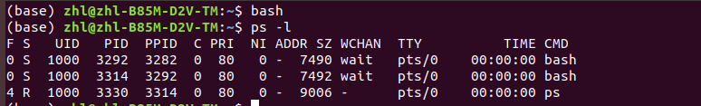
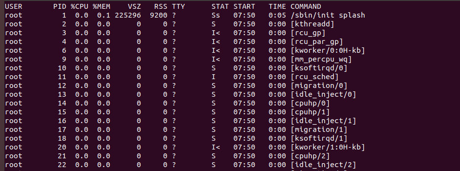

# 1 进程与程序

在Linxu系统中：触发任何一个事件时，系统都会将他定义成一个进程，并且给予这个进程一个ID，称为PID，同时依旧触发这个进程的用户和相关属性关系，给予这个进程一组有效的权限设置

简单来说，进程就是**程序执行的过程**，系统使用**PID**来标识，同时每个进程会根据所在用户获得相应的权限。

## 1.1 具体过程

前提：

程序是代码文件，存储在硬盘中，所有者、所属组和其他人的权限不同

进程是程序的执行过程，在内存中运行，进程沿用程序的权限和属性

操作系统用一个PID来标识进程，方便管理

举个例子：bash shell 这个终端界面也是一个进程

Linux的shell存放在`/bin/bash`中，shell是一个软件（即一段程序）

多用户场景下：

当用户A打开shell时，程序开始在内存中执行，成为了一个进程，此时Linux系统根据这个进程的UID和GID，分配一个PID1

当用户B打开shell时，同样分配了一个PID2

单用户场景下：

用户打开shell时，系统分配了一个PID1

用户在当前shell输入命令（某种意义上，命令也是一段程序），按下[Enter]执行命令时，系统也为其分配了一个PID2

此时，相当于在PID1下衍生出了一个新的PID2，这个PID2会沿用PID1的相关权限，即PID1和PID2时父子关系

在PID2执行的过程中，PID1进入休眠状态，知道PID2退出执行

### 1.2 查看进程信息

打开shell，在当前shell再打开一个shell，然后使用`ps -l`查看进程信息：

可以看到，第一行和PID和第二行的PPID都是3292，说明第二个bash的父进程是第一个bash

同时可以发现，两个bash此时都是wait的状态

而且，第三行的PPID是第二个bash的PID

这说明，bash进入休眠状态，`ps -l`是一个进程，此时是这个进程在运行

### 1.3 进程、子进程、线程

一个比喻：

每个人是一个**进程**，每个人都有自己独立的人格和思想，大家互不干涉。你总不能跑到别人脑袋里面控制他的思想。

**子进程**相当于后代，继承了一个人的一些权限和属性，但又是独立的。

你处于矛盾中，自己头脑中两个想法经常打架。你头脑中的不同的想法就是**线程**。

进程是有自己独立的逻辑地址空间的，所以通常情况下，进程A是无法读写进程B的内存的，共享内存除外。
**线程**是一个进程内部细分的执行单元。一个进程内的所有**线程**共享母进程的逻辑地址空间，所以多**线程**编程要格外注意同步问题。 因为**线程**创建、切换的开销小于进程，所以高性能程序设计越来越喜欢使用**线程**。但是多**线程**编程是一个复杂的问题，新手一般容易出错。

# 2 进程管理

## 2.1 进程的查看 ps

`ps [-A, -a, -u, -l, -f]`：

- -A：显示所有进程，与-e同作用
- -a：显示不与 teminal 有关的所有进程
- -u：有效用户的相关进程
- -l：查看自己的bash相关进程
- -f：做一个更完整的输出

> 查看自己的bash相关进程： `ps -l`

- F：表示进程权限，4表示此进程的权限为root

- S：表示进程状态
  - S：Sleep，睡眠状态，可以被唤醒（Signal）
  - R：Running，正在运行中
  - D：不可被唤醒的睡眠状态，通常这个进程可能在等待I/O的状态（打印）
  - T：停止状态
  - Z：Zombie，僵尸状态，进程已经终止但是无法从内存中删除
- UID/PID/PPID：用户ID/进程ID/父进程ID
- C：CPU使用率，单位为百分比
- PRI/NI：代表进程被CPU所执行的优先级，数值越小，该进程执行的优先级越高
- CMD：command，造成此程序触发的命令

> 查看系统所有进程：`ps aux`

## 2.2 动态查看进程 top

`top [-d 数字] [-p PID] `：

- -d：界面刷新时间，单位秒
- -p：指定某个PID进行监控

## 2.3 进程的管理

进程之间可以相互控制，方法是通过给予进程一个**信号（signal）**，去告诉进程你的操作

**常用信号：**

| 代号 | 名称    | 内容                           |
| ---- | ------- | ------------------------------ |
| 1    | SIGHUP  | 启动被终止的进程，类似重启进程 |
| 2    | SIGINT  | 中断进程，相当于CTRL+C         |
| 9    | SIGKILL | 强制中断进程                   |
| 15   | SIGTERM | 正常终止进程                   |
| 17   | SIGSTOP | 暂停进程，相当于CTRL+Z         |

`kill -signal PID`：给定signal，管理进程

# 3 系统资源的查看

`free [-b/-k/-m/-g] -t`：查看内存使用情况

- -b/-k-m/-g：显示单位b/KB/MB/GB
- -t：在输出的最终结果中显示物理内存与swap的总量

`netstat [-a,-t,-u,-n,-l,-p]`：监控网络

- -a：将目前系统上所有的连接、监听、Socket数据都列出来
- -t：列出tcp网络数据包的数据
- -u：列出udp网络数据包的数据
- -n：不列出进程的服务名称，以端口号来显示
- -l：列出目前正在网络监听的服务
- -p：列出该网络服务的进程PID

